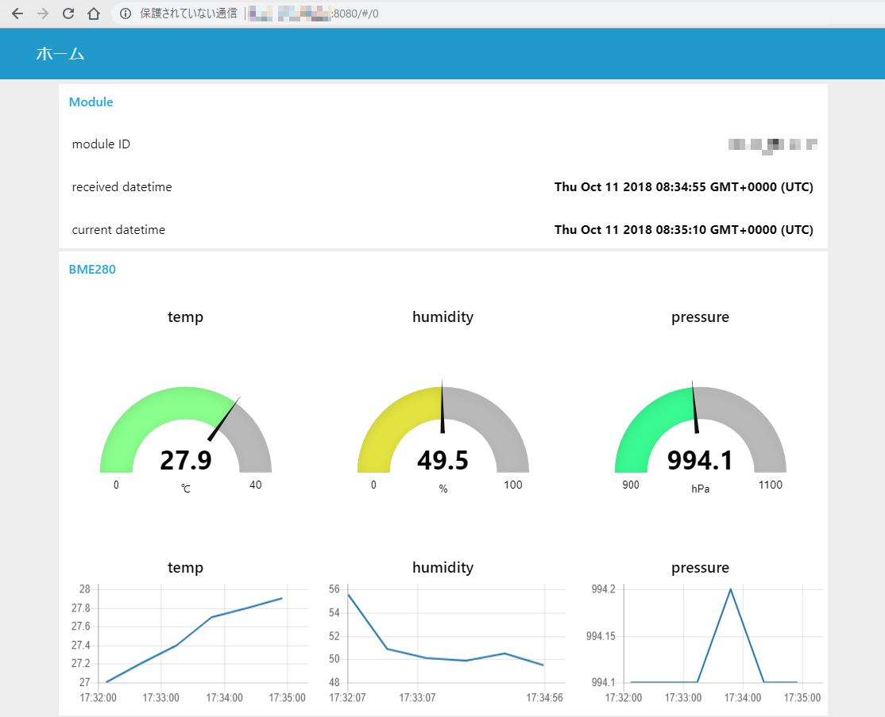

# sakuraio-evb-dashboard

sakura.io 評価ボードで取得・送信されてきたデータを表示するためのサンプルコードと、サンプルコードを動作させるための環境を一つにまとめたプロジェクトです。

サンプルコードはNode-RED上で動作します。[Docker上で動作させるためのファイル群](./docker/)を用いることで簡単に動作させることが可能です。

また、[さくらのクラウド スタートアップスクリプト](./sacloud/)を用いることで、コントロールパネル上での情報入力のみで自動的に環境を構築し、サンプルコードを動作させることができます。

詳しくは [Docker上で動作させるための手順](./docker/README.md) もしくは [さくらのクラウド スタートアップスクリプトを用いたセットアップ手順](./sacloud/README.md) を参照してください。