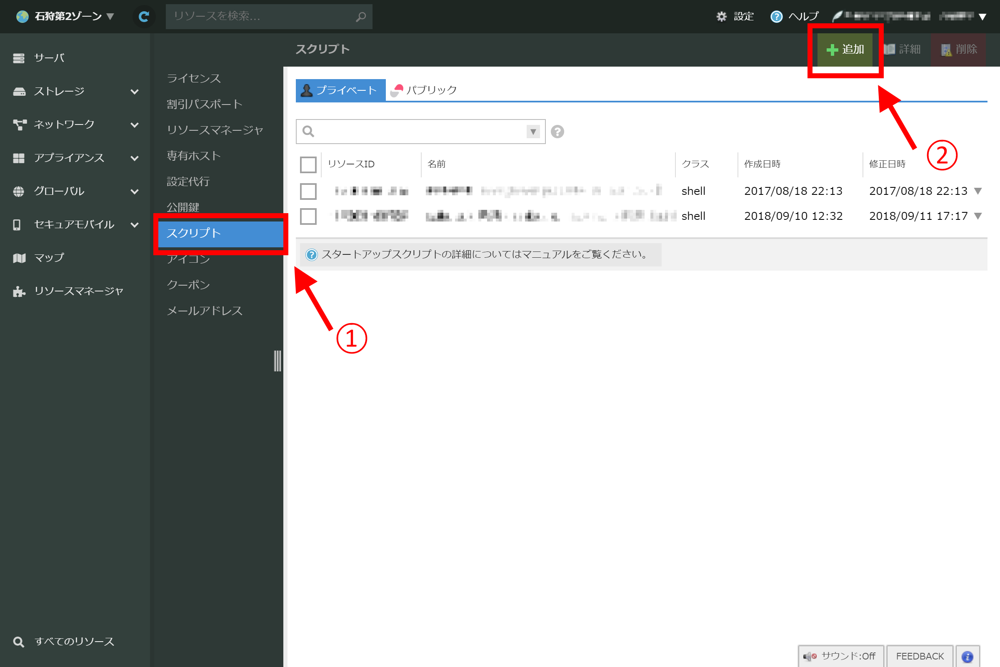

# sakuraio-evb-dashboard スタートアップスクリプト

sakuraio-evb-dashboardを自動的にインストールすることができるスクリプトです。

さくらのクラウドのスタートアップスクリプトとして実装されており、サーバ作成時にスクリプトを選択することで、構築作業なしにsakura.io EVB Dashboardを使用できます。

## スタートアップスクリプトとは
さくらのクラウド上でサーバを作成した際、初回起動時にソフトウェアのインストールなどを自動で行えるよう設定できる機能です。

スタートアップスクリプトについての詳細は、 [スタートアップスクリプトとは | さくらのクラウド ドキュメント](https://manual.sakura.ad.jp/cloud/startup-script/about.html) を参照してください。

## 使い方

### スタートアップスクリプトの登録

さくらのクラウドコントロールパネルにログインし、任意のアカウントを選択します。

スタートアップスクリプトはアカウントを跨いで使用できるため、アカウントが複数ある場合にどのアカウントを選択しても影響はありません。

アカウントを選択したら、 `さくらのクラウド(IaaS)` をクリックします。

サーバ一覧が表示されるので、画面右上に表示されている `設定` をクリックします。

左のメニューの `スクリプト` (下記画像内①)をクリックし、スクリプト一覧が表示されたら画面内右上の `追加` (下記画像内②)をクリックします。

スクリプト追加画面が表示されるので、以下の通り入力を行います。入力が終わったら、 `作成` をクリックしてスクリプトを保存します。

* クラス
    * `シェル` を選択します。
* 名前
    * スクリプトに任意の名前を付けることができます。
* 内容
    * [startup-script.sh](./startup-script.sh) の内容をコピーし、貼り付けてください。
* タグ
* アイコン
    * 必要に応じて設定してください。

### スタートアップスクリプトを用いたサーバの作成

スクリプトの保存が終わったら、スタートアップスクリプトを使ってサーバを作成します。

さくらのクラウド コントロールパネルの画面内左の `サーバ` メニューをクリックし、サーバ一覧を表示します。

右上の `追加` ボタンをクリックして、サーバ作成画面へ移動します。

サーバ作成画面を表示した際、右上の `シンプルモード` にチェックが入っている場合は、チェックボックスをクリックしてシンプルモードを解除してください。

設定すべき項目は以下の通りです。

* `2. ディスク`
    * `アーカイブ選択` にて、名前が `Ubuntu Server` で始まるアーカイブを選択してください。

* `4. ディスクの修正`
    * `ディスクの修正をする` にチェックを入れる
    * `管理ユーザのパスワード` 、 `ホスト名` にそれぞれ任意の値を入力
    * `スタートアップスクリプト` の種類を `shell`
    * `配置するスタートアップスクリプト` のドロップダウンから、スタートアップスクリプト登録の手順で登録した `sakura.io EVB Dashboardのスタートアップスクリプト名` を選択
    * `sakura.io WebSocket連携サービスのToken` , `表示対象のsakura.ioモジュールID` に適切な値を入力
    * `Web UIポート番号` にはダッシュボードを公開するポートを入力してください。何も入力しなかった場合は自動的に8080番ポートで公開します

* `6. サーバの情報`
    * `名前` に任意の名前を入力してください。ここで入力した情報はさくらのクラウド コントロールパネル上で表示されます。

設定項目への入力が済んだら、 `作成` ボタンを押してサーバを作成します。

サーバ作成後、サーバがはじめて起動するタイミングでsakura.io EVB DashboardがDocker上で実行されるように設定が行われます。

サーバ内のソフトウェアのアップグレードや関連するソフトウェアのインストールなどが実行されます。
サーバを起動してからインストールが完了するまで10分程度待った後、手元のウェブブラウザに `http://サーバのIPアドレス:Web UIポート番号` と入力すると、sakura.io EVB Dashboardの起動が確認できます。

